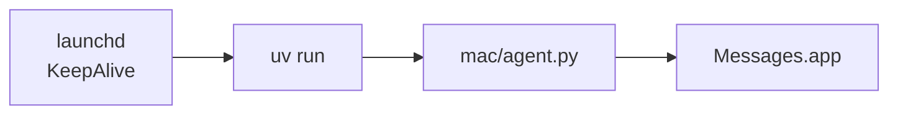

# INSTALL.md — full install guide

End-to-end install for both producer (anywhere) and Mac agent. Assumes you've completed the [Azure quickstart](./infra/azure-quickstart.md) and have `az login` working.

## Prerequisites

| Tool          | Why                                  | Install                                                              |
|---------------|--------------------------------------|----------------------------------------------------------------------|
| `uv`          | Python tooling (we never use pip)    | `curl -LsSf https://astral.sh/uv/install.sh \| sh`                   |
| `az` CLI      | Azure provisioning + OAuth login     | https://learn.microsoft.com/cli/azure/install-azure-cli              |
| `gh` CLI      | GitOps (clone, PR)                   | https://cli.github.com/                                              |
| Python ≥ 3.10 | Runtime (uv installs it for you)     | `uv python install 3.12`                                             |

## 1. Clone and sync

```bash
gh repo clone paulyuk/imessage-bridge
cd imessage-bridge
uv sync                  # installs deps from pyproject.toml + lockfile
uv sync --extra dev      # add this if you want to run tests
```

## 2. Configure

```bash
cp config.example.json config.json
# edit:
#   "namespace_fqdn": "<your-namespace>.servicebus.windows.net"
#   "queue":          "imsg-queue"
```

`config.json` is gitignored. Never commit it.

## 3. Auth (one-time)

```bash
az login                       # opens browser; tokens cached in ~/.azure
# OR for headless:
az login --use-device-code
```

`DefaultAzureCredential` picks up the cached token automatically. No env vars needed for dev.

## 4. Smoke test

```bash
# verify auth + role assignment works:
uv run producer/cli.py --to "+15555550100" --body "smoke test"
# expect: enqueued <uuid> -> +15555550100
```

If you get a 401 / `AccessDenied`, your identity doesn't have the `Azure Service Bus Data Sender` role on the queue. See [Azure quickstart §2](./infra/azure-quickstart.md#2-grant-rbac-roles-to-identities-no-connection-strings).

## 5. Start the Mac agent

Think of the daemon setup as one arc: **foreground-test → install → verify → done**.

### 5.1 Foreground-test first (required once)

```bash
uv run mac/agent.py
# logs to stdout + ./logs/agent.log
```

Send a test message from the producer and watch it arrive in `Messages.app`.
The first successful send should trigger a macOS **Automation** prompt. Click
**Allow**, then press ctrl-C to stop the foreground agent.

> ⚠️ **Do not skip this.** launchd cannot show the Automation prompt. If the
> permission has not been granted, the daemon will start but `osascript` will
> fail with *"Not authorized to send Apple events to Messages."* See
> [§6](#6-macos-permissions-the-gotcha).

### 5.2 Install the LaunchAgent

```bash
./mac/launchd/install.sh
```

The installer is safe to re-run after `git pull`. It detects `uv`, `$HOME`, and
the repo root; renders `mac/launchd/com.imessage-bridge.agent.plist` with absolute
paths; validates the rendered plist with `plutil -lint`; copies it to
`~/Library/LaunchAgents/com.imessage-bridge.agent.plist`; then uses the modern
`launchctl bootstrap gui/$UID` API and `kickstart`s the agent immediately.



The plist sets:
- `KeepAlive=true` — restart the agent if it exits.
- `ThrottleInterval=60` — avoid CPU-burning crash loops.
- `ProcessType=Background` — keep it low priority.
- `HOME` + `PATH` — let `uv` find caches and `~/.azure` tokens without a wrapper script.

### 5.3 Verify it is running

```bash
launchctl print gui/$(id -u)/com.imessage-bridge.agent | head -20
# look for: state = running
```

```bash
plutil -lint ~/Library/LaunchAgents/com.imessage-bridge.agent.plist
```

### 5.4 Logs and common commands

Start here when something feels off:

```bash
launchctl print gui/$(id -u)/com.imessage-bridge.agent | head -20  # status
tail -F logs/agent.log                                           # follow app logs
tail -n 50 logs/agent.launchd.log                                # early startup errors
launchctl kickstart -k gui/$(id -u)/com.imessage-bridge.agent      # restart now
./mac/launchd/install.sh                                         # re-render + restart
./mac/launchd/uninstall.sh                                       # stop + remove
```

The two log files tell different stories:
- `logs/agent.log` — structured application logs (Python `logging`).
- `logs/agent.launchd.log` — stdout/stderr from launchd, including errors that
  happen *before* Python logging initializes (missing config, import failures,
  Automation denials).

## 6. macOS permissions (the gotcha)

`Messages.app` automation requires user consent. **The first time the agent calls `osascript`, macOS will prompt you** to allow the controlling process (usually Terminal during the foreground run) to control Messages. Click **Allow**.

launchd cannot display that prompt. If you skip the foreground run, the daemon can be `running` and still fail every send with "Not authorized to send Apple events to Messages."

You can audit this in:

> System Settings → Privacy & Security → Automation → (Terminal / uv / launchd) → ✅ Messages

## 7. Run tests

```bash
uv run pytest
```

5 tests, mocked Service Bus + osascript. No Azure or Mac required.

## Upgrade / update

```bash
git pull
uv sync                           # picks up new deps
./mac/launchd/install.sh          # re-render plist + restart agent (idempotent)
```
