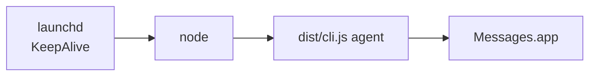

# INSTALL.md — full install guide

End-to-end install for both producer (anywhere) and Mac agent. Assumes you've completed the [Azure quickstart](./infra/azure-quickstart.md) and have `az login` working.

## TL;DR — npm path

```bash
# one-liner — no clone, no install step:
npx imessage-bridge@alpha send --to "+15555550100" --body "smoke test"
```

Needs a `config.json` in the current directory (or `IMSG_CONFIG=/path/to/config.json`). Skip to [§2 Configure](#2-configure) below to create one. Everything else (`agent`, `doctor`, `--help`) works the same way under `npx imessage-bridge@alpha …`.

Want it permanently on `PATH`? `npm i -g imessage-bridge@alpha`, then drop the `npx` prefix.

## Prerequisites

| Tool          | Why                                  | Install                                                              |
|---------------|--------------------------------------|----------------------------------------------------------------------|
| Node.js ≥ 22 (LTS, recommend 24) | Runtime for the CLI and the daemon | `nvm install 24 && nvm use 24` (or `brew install node`, or https://nodejs.org/) |
| `az` CLI      | Azure provisioning + OAuth login     | https://learn.microsoft.com/cli/azure/install-azure-cli              |
| `gh` CLI      | Optional — only needed if you clone the repo (launchd installer / contributing) | https://cli.github.com/ |
| `signal-cli`  | Signal consumer only: local Signal sender | `brew install signal-cli` on macOS, or [an upstream release](https://github.com/AsamK/signal-cli/releases/latest) |

> Node 22 (Jod) is the minimum because the project depends on the Node 22 native test runner + `parseArgs`. Node 24 (Krypton) is the current Active LTS — recommended for new installs.

## 1. Clone (optional)

If you only want to send messages, **skip this** — `npx imessage-bridge@alpha` is enough. Clone only if you want to:

- Use the `mac/launchd/` installer to run the agent as a permanent macOS daemon
- Contribute to the repo

```bash
gh repo clone paulyuk/imessage-bridge
cd imessage-bridge
npm install              # installs Node deps; needed for `mac/launchd/install.sh` and `npm test`
```

## 2. Configure

Drop a `config.json` next to wherever you'll run the CLI:

```bash
cat > config.json <<'JSON'
{
  "namespace_fqdn": "<your-namespace>.servicebus.windows.net",
  "queue": "imsg-queue",
  "signature": "🐩"
}
JSON
```

`config.json` is gitignored. Never commit it. Prefer not to clutter your cwd? Set `IMSG_CONFIG=~/.config/imessage-bridge.json` and the CLI will read from there.

## 3. Auth (one-time)

```bash
az login                       # opens browser; tokens cached in ~/.azure
# OR for headless:
az login --use-device-code
```

`DefaultAzureCredential` picks up the cached token automatically. No env vars needed for dev.

## 4. Smoke test

```bash
npx imessage-bridge@alpha send --to "+15555550100" --body "smoke test"
# expect: enqueued <uuid> -> +15555550100
```

If you get a 401 / `AccessDenied`, your identity doesn't have the `Azure Service Bus Data Sender` role on the queue. See [Azure quickstart §2](./infra/azure-quickstart.md#2-grant-rbac-roles-to-identities-no-connection-strings).

## 5. Start the Mac agent

Think of the daemon setup as one arc: **foreground-test → install → verify → done**.

### 5.1 Foreground-test first (required once)

```bash
npx imessage-bridge@alpha agent
# logs to stdout + ./logs/agent.log
```

Send a test message from the producer and watch it arrive in `Messages.app`.
The first successful send should trigger a macOS **Automation** prompt. Click
**Allow**, then press ctrl-C to stop the foreground agent.

> ⚠️ **Do not skip this.** launchd cannot show the Automation prompt. If the
> permission has not been granted, the daemon will start but `osascript` will
> fail with *"Not authorized to send Apple events to Messages."* See
> [§7](#7-macos-permissions-the-gotcha).

### 5.2 Install the LaunchAgent

```bash
# from the cloned repo:
./mac/launchd/install.sh
```

The installer is idempotent — safe to re-run after `git pull`. It detects `node`, `$HOME`, and the repo root; runs `npm install --omit=dev` if `node_modules` is missing; builds the TypeScript to `dist/cli.js`; renders `mac/launchd/com.imessage-bridge.agent.plist` with absolute paths; validates with `plutil -lint`; copies to `~/Library/LaunchAgents/`; and uses the modern `launchctl bootstrap gui/$UID` API to register and `kickstart` the agent.



The plist sets:
- `KeepAlive=true` — restart the agent if it exits.
- `ThrottleInterval=60` — avoid CPU-burning crash loops.
- `ProcessType=Background` — keep it low priority.
- `HOME` + `PATH` — let the agent find `~/.azure` token cache and `az` on PATH without a wrapper script.

### 5.3 Verify it is running

```bash
launchctl print gui/$(id -u)/com.imessage-bridge.agent | head -20
# look for: state = running
```

```bash
plutil -lint ~/Library/LaunchAgents/com.imessage-bridge.agent.plist
```

### 5.4 Logs and common commands

Start here when something feels off:

```bash
launchctl print gui/$(id -u)/com.imessage-bridge.agent | head -20  # status
tail -F logs/agent.log                                           # follow app logs
tail -n 50 logs/agent.launchd.log                                # early startup errors
launchctl kickstart -k gui/$(id -u)/com.imessage-bridge.agent      # restart now
./mac/launchd/install.sh                                         # re-render + restart
./mac/launchd/uninstall.sh                                       # stop + remove
```

The two log files tell different stories:
- `logs/agent.log` — structured application logs.
- `logs/agent.launchd.log` — stdout/stderr from launchd, including errors that
  happen *before* logging initializes (missing config, import failures,
  Automation denials).

## 6. Optional: run the Signal consumer

The Signal consumer is a sibling of the iMessage agent: it receives only from
`signal_queue` and sends through the local `signal-cli` account named by
`signal_account`. It does **not** register or link a Signal account for you.
Complete the following manual work before starting it.

1. Install `signal-cli`:

   ```bash
   brew install signal-cli
   command -v signal-cli
   ```

2. Choose **one** account setup path. Use an E.164 account placeholder; do not
   put a real account number in a checked-in config or command history.

   - **Link an existing account** (recommended): run the following command,
     then use Signal's *Linked devices* flow on the existing mobile app to
     scan the URI it displays.

     ```bash
     signal-cli link
     ```

   - **Register a new account**: registration requires receiving an SMS or
     voice verification code. It can unregister an existing client associated
     with that number, so do not use it to link an existing account.

     ```bash
     signal-cli -a "<signal-account-e164>" register
     signal-cli -a "<signal-account-e164>" verify "<verification-code>"
     ```

   Keep `signal-cli` current; its upstream project warns that old releases can
   become incompatible with Signal service changes. Signal account keys stay
   with the macOS user who ran these commands, so use that same user for
   launchd.

3. Provision a dedicated queue and queue-scoped roles as described in
   [Azure quickstart §5](./infra/azure-quickstart.md#5-optional--provision-the-signal-queue-and-rbac).
   Do not reuse the iMessage queue or give either Signal identity namespace-wide
   access.

4. Add the Signal settings to the Mac's `config.json`:

   ```json
   {
     "namespace_fqdn": "<your-namespace>.servicebus.windows.net",
     "queue": "imsg-queue",
     "signal_queue": "signal-queue",
     "signal_account": "<signal-account-e164>",
     "signal_log_path": "./logs/signal-agent.log"
   }
   ```

   The Signal consumer has no recipient allowlist or self-only rule:
   `signal-agent` intentionally ignores the iMessage
   `allowed_recipients` setting. It may send to any valid E.164 destination;
   the Signal consumer rejects non-E.164 destinations, including Signal
   usernames.

5. On the producer host, make a separate config that targets the Signal queue.
   `signal-send` reads `signal_queue` and enqueues there. `send` remains the
   iMessage-only producer route and reads `queue`:

   ```bash
   cat > signal-producer.config.json <<'JSON'
   {
     "namespace_fqdn": "<your-namespace>.servicebus.windows.net",
     "queue": "imsg-queue",
     "signal_queue": "signal-queue"
   }
   JSON
   ```

6. From the cloned repo on the Mac, build and foreground-test before installing
   launchd. In a second terminal on a cloned, built Signal-producer checkout,
   enqueue a fictional smoke-test destination after configuring its real
   namespace locally:

   ```bash
   # Mac checkout
   npm run build
   node dist/cli.js signal-agent --config config.json
   ```

   In a separate producer terminal:

   ```bash
   # Signal-producer checkout
   npm run build
   node dist/cli.js signal-send --config signal-producer.config.json \
     --to "+15555550100" --body "Signal bridge smoke test"
   ```

   Watch the Mac terminal for a successful send, then stop the foreground
   consumer with ctrl-C. This test exercises the installed account and
   queue-specific receiver role without changing the iMessage consumer.

7. Install the independent Signal LaunchAgent and verify its health:

   ```bash
   ./mac/launchd/install-signal.sh
   launchctl print gui/$(id -u)/com.imessage-bridge.signal-agent | head -20
   tail -F logs/signal-agent.log
   tail -n 50 logs/signal-agent.launchd.log
   ```

   Re-run `install-signal.sh` after a Node or `signal-cli` path change. To
   remove only the Signal consumer, run:

   ```bash
   ./mac/launchd/uninstall-signal.sh
   ```

   The launchd service being `running` and a `connected to service bus,
   listening...` entry in `logs/signal-agent.log` are the basic health signal.
   For failed deliveries, `signal-cli` errors appear in the app log and the
   Service Bus message is abandoned for retry; see
   [Troubleshooting](./TROUBLESHOOTING.md#signal-consumer).

## 7. macOS permissions (the gotcha)

`Messages.app` automation requires user consent. **The first time the agent calls `osascript`, macOS will prompt you** to allow the controlling process (usually Terminal during the foreground run) to control Messages. Click **Allow**.

launchd cannot display that prompt. If you skip the foreground run, the daemon can be `running` and still fail every send with "Not authorized to send Apple events to Messages."

You can audit this in:

> System Settings → Privacy & Security → Automation → (Terminal / node / launchd) → ✅ Messages

## 8. Run tests (contributors only)

```bash
npm test            # Node tests (16 cases, mocked)
```

Runs fully offline — no Azure or Mac required.

## Upgrade / update

End users:
```bash
# nothing to do — npx always pulls the latest @alpha
npx imessage-bridge@alpha --version
```

Cloned repo / launchd users:
```bash
git pull
npm install                       # picks up new Node deps
./mac/launchd/install.sh          # re-render plist + rebuild + restart agent (idempotent)
```
