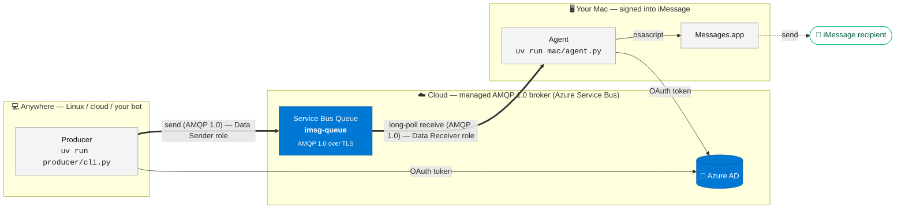
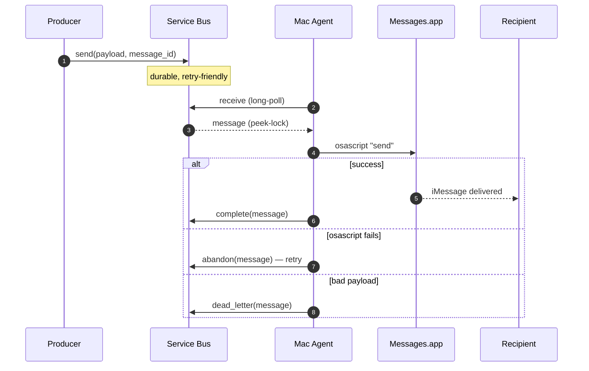

<div align="center">

# 📨 imessage-bridge

**Send iMessages from anywhere. Without a Mac on the public internet.**

A small, opinionated bridge that lets an inexpensive Linux/cloud "producer" (or your favorite [openclaw](https://github.com/openclaw/openclaw) 🦞) enqueue messages securely and async over **AMQP 1.0** into a managed broker, and a tiny agent on your Mac pulls them out and sends them through `Messages.app`. No inbound ports to attack. No SAS keys. No PATs.

[](https://github.com/openclaw/openclaw)
[](https://www.amqp.org/)
[](https://docs.dapr.io/reference/components-reference/supported-pubsub/)
[](./SECURITY.md)
[](https://github.com/astral-sh/uv)
[](./LICENSE)
[](./producer/cli.py)
[](./mac/launchd/install.sh)

[Quick start](#-quick-start) · [Architecture](#-architecture) · [Standards & portability](#-standards--portability) · [Install](./INSTALL.md) · [Troubleshooting](./TROUBLESHOOTING.md) · [Security](#-security) · [Contributing](#-contributing)

</div>

---

## ✨ Why this exists

iMessage is a walled garden. If you want to send an iMessage programmatically, you need a Mac signed into iCloud running `Messages.app`. That Mac shouldn't be exposed to the internet, and you shouldn't be juggling long-lived secrets to talk to it.

`imessage-bridge` solves both:

- **Producer-anywhere, consumer-on-Mac** — the producer is just a cmdline tool call for humans or agents to send a message securely like you would want to in a claw; the Mac only makes _outbound_ calls to the broker and then forwards to iMessage via `Messages.app`. Nothing inbound. No port forwarding. No tunnels.
- **OAuth + Microsoft Entra identities** — no SAS connection strings, no PATs, no `.env` files full of secrets, or other things to get complicated and get Pwnd. Both ends authenticate via `DefaultAzureCredential`. Don't let Entra scare you — it works with Free Azure accounts and consumer outlook.com accounts. Or just take this pattern and use the ecosystem you prefer for identity and cloud hosting. No biggie.
- **Standards under the hood** — the wire protocol is **AMQP 1.0** (OASIS / [ISO/IEC 19464](https://www.iso.org/standard/64955.html)), not a vendor-proprietary format. Your queue is just a queue. See [Standards & portability](#-standards--portability) below.
- **Built in the [openclaw](https://github.com/openclaw/openclaw) 🦞 spirit** — own your data, own your infra, ship one more "claw" into a walled-garden ecosystem so your agents can act on your behalf. Each [`skills/`](./skills/) entry follows the openclaw skill format so this folder drops cleanly into any openclaw-style runtime (or any other agent framework that consumes `SKILL.md`).
- **Tiny surface area** — ~100 lines of producer + ~150 lines of agent. Easy to read, easy to fork, easy to trust.

## 🏗 Architecture



- **Producer** authenticates with `DefaultAzureCredential` and has **only** the `Azure Service Bus Data Sender` role on the queue.
- **Mac agent** authenticates the same way and has **only** the `Azure Service Bus Data Receiver` role.
- **Two distinct Azure AD identities**, one role each — least privilege, no shared secrets, no Service Principals.
- **The Mac only makes outbound calls** — no inbound ports, no tunnels, no exposed surface.
- **Service Bus tier: Basic.** ~$0/month at our volume (no base fee, ~$0.05/M ops).

### Message lifecycle



## 📐 Standards & portability

This project is built on **standards**, not vendor primitives. The default deployment uses Azure Service Bus because it's a cheap, managed AMQP broker with first-class Azure AD auth — but the wire format and patterns are portable.

| Layer | Standard / Spec | Why it matters |
|---|---|---|
| **Wire protocol** | [AMQP 1.0](https://www.amqp.org/) (OASIS, [ISO/IEC 19464](https://www.iso.org/standard/64955.html)) | Same protocol RabbitMQ, ActiveMQ Artemis, Solace, IBM MQ, AWS MQ, and Azure Service Bus all speak. Your queue is just a queue. |
| **Auth** | [OAuth 2.0](https://oauth.net/2/) + [OpenID Connect](https://openid.net/connect/) (Microsoft Entra as the IdP) | No SAS keys, no PATs, no client secrets. Token-based, instantly revocable. |
| **Phone format** | [E.164](https://en.wikipedia.org/wiki/E.164) | The same format Twilio, Telegram, WhatsApp, and SMS gateways all expect. |
| **Message shape** | JSON, AMQP `message_id` for idempotency | Trivial to interop with anything. |
| **Skill format** | [`SKILL.md`](./skills/README.md) frontmatter + sections, as used by [openclaw](https://github.com/openclaw/openclaw) 🦞 | The whole [`skills/`](./skills/) folder drops cleanly into any openclaw runtime — install-mac, install-producer, send-message, doctor, logs are all reusable claws. |

### Swap the broker

The default flow uses `azure-servicebus` (an AMQP 1.0 client). To run against a **different AMQP 1.0 broker** (e.g. RabbitMQ, ActiveMQ Artemis, Apache Qpid), swap the client library — the producer/consumer logic stays the same. Roughly ~30 lines change, mostly imports and connection setup.

### Or use Dapr

For full broker portability *without* swapping client libraries, run the producer behind a [Dapr](https://dapr.io/) sidecar and use the [pubsub building block](https://docs.dapr.io/developing-applications/building-blocks/pubsub/pubsub-overview/). Dapr ships [pluggable pubsub components](https://docs.dapr.io/reference/components-reference/supported-pubsub/) for Service Bus, RabbitMQ, Kafka, NATS, Redis, AWS SNS/SQS, GCP Pub/Sub, and ~15 others — same producer code, change one config file to switch broker. A `examples/dapr/` reference implementation is on the roadmap.

> **TL;DR:** This isn't an Azure-only toy. Azure Service Bus is the default because it's the cheapest AMQP-with-AAD-OAuth broker on the market for low volumes (~$0/month at our scale). Everything else is standards.

## ⚡ Quick start

You'll need: an [Azure subscription](https://azure.microsoft.com/en-us/free) (the free tier is fine), the [`az` CLI](https://learn.microsoft.com/cli/azure/install-azure-cli), [`uv`](https://github.com/astral-sh/uv), and a Mac signed into iMessage.

### 1. Provision Azure (~2 minutes)

```bash
RG=imessage-bridge
NS=$RG-$(whoami)                # namespace must be globally unique
QUEUE=imsg-queue
LOC=westus2

az group create -n $RG -l $LOC
az servicebus namespace create -g $RG -n $NS --sku Basic
az servicebus queue create -g $RG --namespace-name $NS -n $QUEUE
```

### 2. Grant least-privilege RBAC roles — one role per machine

Each machine logs in as its own Azure AD identity and gets **only** the role it needs. No shared identities, no Service Principals, no secrets.

```bash
SCOPE=$(az servicebus queue show -g $RG --namespace-name $NS -n $QUEUE --query id -o tsv)
```

**On the producer machine (sends only):**

```bash
az login --use-device-code            # log in as the producer identity
ME=$(az ad signed-in-user show --query id -o tsv)
az role assignment create --assignee $ME --role "Azure Service Bus Data Sender" --scope $SCOPE
```

**On the Mac (receives only):**

```bash
az login                              # log in as the Mac identity
ME=$(az ad signed-in-user show --query id -o tsv)
az role assignment create --assignee $ME --role "Azure Service Bus Data Receiver" --scope $SCOPE
```

> 🔐 **Identity-only auth.** This project never uses Service Principals, client secrets, certificates, SAS keys, or PATs. Both sides authenticate with `az login` (Azure AD user identity); `DefaultAzureCredential` discovers the cached token. See [SECURITY.md](./SECURITY.md).

### 3. Clone, configure, install

Clone the repo, create a local config.json, and populate it with the Service Bus namespace FQDN you created in step 1.

```bash
gh repo clone paulyuk/imessage-bridge
cd imessage-bridge
uv sync                                  # installs deps from pyproject/lockfile
```

After you provisioned the namespace in step 1, determine the namespace FQDN and put it into config.json. The namespace FQDN is simply:

    <your-namespace>.servicebus.windows.net

Example: if you created `NS=$RG-$(whoami)` and that evaluated to `imessage-bridge-yourname`, the namespace FQDN is:

    imessage-bridge-yourname.servicebus.windows.net

Create the config file (one of these options):

- Quick manual edit (recommended):

```bash
cp config.example.json config.json
# open config.json in your editor and replace the namespace_fqdn and queue values
# Example config.json contents to paste:
# {
#  "namespace_fqdn": "imessage-bridge-yourname.servicebus.windows.net",
#  "queue": "imsg-queue",
#  "model": "gpt-5.4-mini",
#  "model_version": "latest",
#  "poll_interval_s": 3,
#  "log_path": "./logs/agent.log"
# }
```

- Or generate it from the shell (safe / scriptable):

```bash
NS=imessage-bridge-yourname   # or whatever you picked above
FQDN="$NS.servicebus.windows.net"
cat > config.json <<JSON
{
  "namespace_fqdn": "$FQDN",
  "queue": "imsg-queue",
  "model": "gpt-5.4-mini",
  "model_version": "latest",
  "poll_interval_s": 3,
  "log_path": "./logs/agent.log"
}
JSON
```

Notes:
- config.json is gitignored. Do not commit it.
- `namespace_fqdn` must exactly match the Service Bus namespace FQDN (no protocol, no trailing slash).
- If you’re unsure what the namespace name is, you can list namespaces with:

```bash
az servicebus namespace list -g $RG -o table
```

and inspect the `name` column — append `.servicebus.windows.net` to form the FQDN.

### 4. Log in once with OAuth

```bash
az login                                 # opens browser; tokens cached in ~/.azure
# OR for headless boxes:
az login --use-device-code
```

That's it for auth. `DefaultAzureCredential` picks up the cached `az` tokens automatically. **No connection strings, no PATs, no SAS keys.**

### 5. Send a message

```bash
# from anywhere (Linux, Mac, cloud) — enqueue:
uv run producer/cli.py --to "+14255551234" --body "hey from the bridge 👋"

# on the Mac — start the consumer:
uv run mac/agent.py
```

The Mac picks it up within a few seconds and `Messages.app` sends it. ✨

### 6. Make the Mac agent permanent

The safe path is one clear arc: **foreground-test → install → verify → done**.

> ⚠️ **Do the foreground run first.** macOS must show the **Automation** prompt for
> `Messages.app`, and you must click **Allow**. Under launchd, macOS cannot show
> that prompt — the agent will just fail with *"Not authorized."*

```bash
uv run mac/agent.py        # ctrl-C after you click Allow on the Automation prompt
./mac/launchd/install.sh   # render plist, register with launchd, start now
```

```bash
launchctl print gui/$(id -u)/com.imessage-bridge.agent | head -20 # status
tail -F logs/agent.log                                          # follow app logs
```

That's it. The installer is idempotent, so re-run it after `git pull` to pick up
new code. Full daemon setup and common commands: [INSTALL.md](./INSTALL.md#5-start-the-mac-agent).
Troubleshooting starts with the two log files: [TROUBLESHOOTING.md](./TROUBLESHOOTING.md#launchd).

## 🐍 Python tooling — we use `uv`

This project standardizes on **[uv](https://github.com/astral-sh/uv)** for everything Python. Faster, lockfile-driven, reproducible. We do not invoke `python3` or `pip` directly. Because we're rad.

| Task               | ❌ Don't                       | ✅ Do                            |
|--------------------|--------------------------------|----------------------------------|
| Run a script       | `python3 mac/agent.py`         | `uv run mac/agent.py`            |
| Install deps       | `pip install -r req.txt`       | `uv pip install -r req.txt`      |
| New venv           | `python3 -m venv .venv`        | `uv venv`                        |
| Sync from lock     | —                              | `uv sync`                        |
| Add a dep          | `pip install azure-servicebus` | `uv add azure-servicebus`        |
| Run tests          | `pytest`                       | `uv run pytest`                  |

If you find a stray `python3` or `pip` invocation anywhere — code, docs, plists, CI — please open a fix. See [`AGENTS.md`](./AGENTS.md) for the full agent contract.

## 🔐 Security

**Auth model: identity-only.** No long-lived secrets, anywhere, ever.

- ✅ `DefaultAzureCredential` everywhere — backed by `az login` (Azure AD user identity).
- ✅ Producer and consumer (Mac) are **two distinct Azure AD users**, each with **only one** RBAC role on the queue (Sender on the producer host, Receiver on the Mac). True least privilege.
- ✅ Tokens cached + refreshed by Azure CLI in `~/.azure`. Revoke instantly via `az logout` or by removing the role assignment.
- ❌ **No Service Principals.** No client secrets, no certificate-as-secret, no federated credentials with PATs.
- ❌ **No SAS connection strings.** Anywhere.
- ❌ **No PATs.** GitOps uses `gh auth login` (OAuth web flow) only.
- ❌ **No secrets committed.** PRs are PII-scanned for phone numbers, emails, and key patterns.

Upgrade path — only these are acceptable when user identity isn't enough:
- **Managed Identity** (workload runs in Azure)
- **Workload Identity Federation** (workload outside Azure, federated to AAD without secrets)
- **Azure Arc** (bring the host into Azure as a managed resource)

See [`SECURITY.md`](./SECURITY.md) for the full rule + threat model.

## 📁 Repo layout

```
imessage-bridge/
├── producer/
│   ├── __init__.py
│   └── cli.py               # enqueue CLI — runs anywhere
├── mac/
│   ├── agent.py             # long-running consumer
│   ├── send_applescript.py  # osascript wrapper
│   ├── requirements.txt
│   └── launchd/
│       ├── com.imessage-bridge.agent.plist  # LaunchAgent template
│       ├── install.sh                     # render + bootstrap
│       └── uninstall.sh                   # bootout + remove
├── infra/
│   └── azure-quickstart.md  # az cli provisioning
├── .squad/                  # Brady Gaster Squad config
├── AGENTS.md                # binding rules for human + bot agents
├── README.md                # you are here
└── config.example.json
```

## 🤝 Contributing

PRs welcome. This repo runs the [Brady Gaster Squad](https://github.com/bradygaster/squad) — every PR triggers squad validation (PII flag + schema check).

- Default branch: `main`. Never `master`.
- All Python invocations use `uv` (see [`AGENTS.md`](./AGENTS.md)).
- DevRel agent owns this README. Improvements to docs are extra-welcome.
- Read [`CONTRIBUTING.md`](./CONTRIBUTING.md) for the PR flow.

## 📄 License

MIT — see [`LICENSE`](./LICENSE).

---

<div align="center">
<sub>Built with 🐩 by the Brady Gaster Squad. DevRel-approved.</sub>
</div>

🐉
